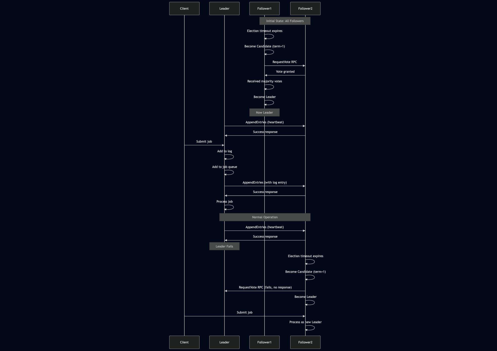
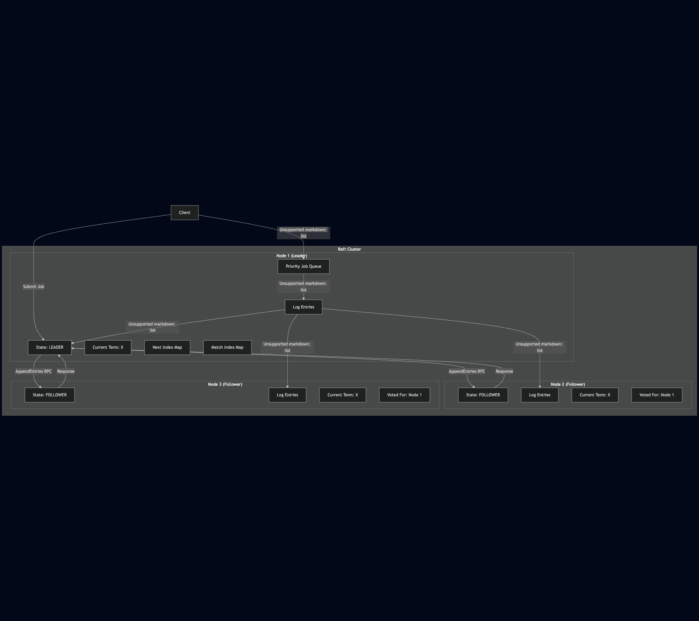

## Overview
The Bookstore Application follows a modern microservices-based architecture. The architecture consists of three primary layers:
1. **Client-Facing Layer**
2. **Microservices Layer (gRPC Services)**
3. **Data Layer**

## Client-Facing Layer
### REST Checkout API
The **REST Checkout API** serves as the single entry point for client interactions. It handles customer checkout requests and orchestrates calls to the underlying microservices. Key features include:
- Orchestrating multiple microservices to complete the checkout process.
- The orchestrator acts as the single point of contact between the microservices.

#### Threading Implementation
Since several microservices are exchanging information we have threading implementation to pass the information between the microservices. The threading implementation is done using **ThreadPoolExecutor** from the **concurrent.futures** module. This allows for efficient management of multiple threads, enabling the application to handle concurrent requests without blocking the main thread. The threading implementation is designed to:

## Microservices Layer (gRPC Services)
This layer consists of independent services that handle specific tasks and communicate via **gRPC** 

### 1. Suggestions Microservice
- Connects to a **PostgreSQL database** with the **pgvector** extension.
- Uses **sentence-transformers** to generate vector embeddings of book descriptions, its title and the author.
- Provides **personalized book recommendations** based on vector similarity.
- Enables **efficient semantic search** capabilities for books.

### 2. Fraud Detection Service
- Analyzes checkout transactions for potential fraud.
- Returns a **risk assessment score** to the checkout service to prevent fraudulent activities.

### 3. Validation Service
- Performs **credit card validation** using the **Luhn algorithm** to verify card numbers.
- Checks **expiration dates** to ensure the card is still valid.
- Provides a **fast validation layer** before payment processing to prevent invalid transactions.

## Data Layer
### PostgreSQL Database
- Serves as the **primary data store** for the application.
- Stores book metadata, user transactions, and other essential records.

### pgvector Extension
- A **specialized PostgreSQL extension** that enables efficient **vector operations and similarity searches**.

## Architecture Diagram

---

## System Diagram

## Vector Clock Diagram

## Raft Consensus Algorithm

In our implementation each node has its own state, which can be one of the following:
- Follower: Passive state where nodes receive updates from the leader
- Candidate: When a node believes there's no leader and attempts to become one
- Leader: Coordinates all changes to the distributed system

### Core Mechanisms

- Leader Election: When followers don't hear from a leader, they become candidates and request votes
- Log Replication: Leaders accept commands and replicate them to followers
- Safety: Various rules ensure consistency even during network partitions

### Practical Features

- Priority-based job queue
- Thread-safety with multiple locks
- gRPC communication between nodes
- Peer discovery and dynamic configuration

### Sequence Diagram

## High-Level Overview of the architecture

---
