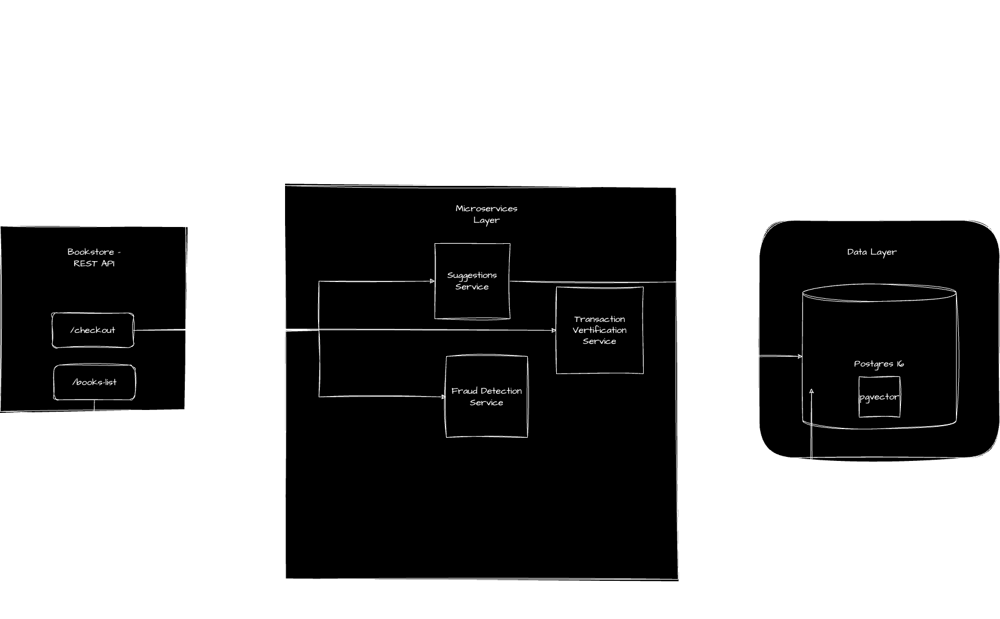
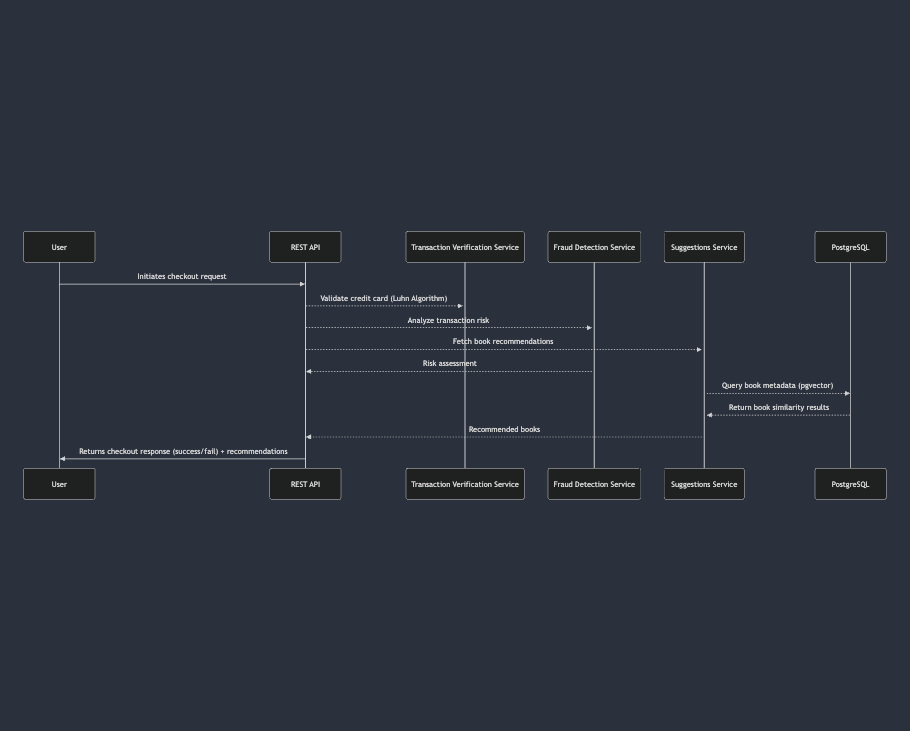
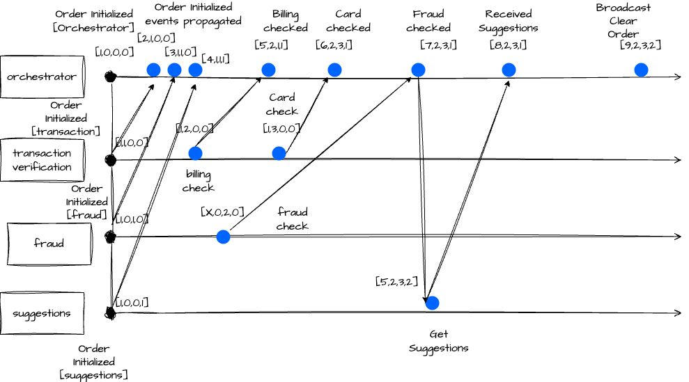
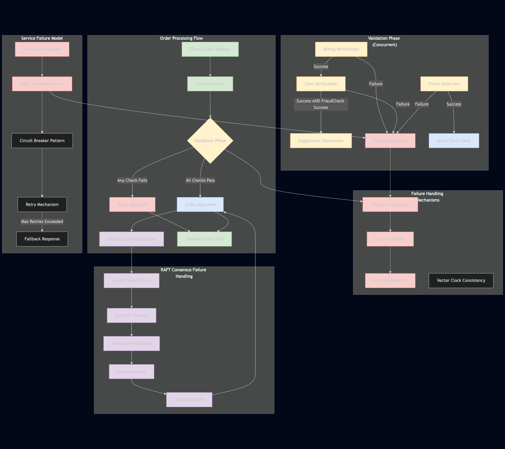
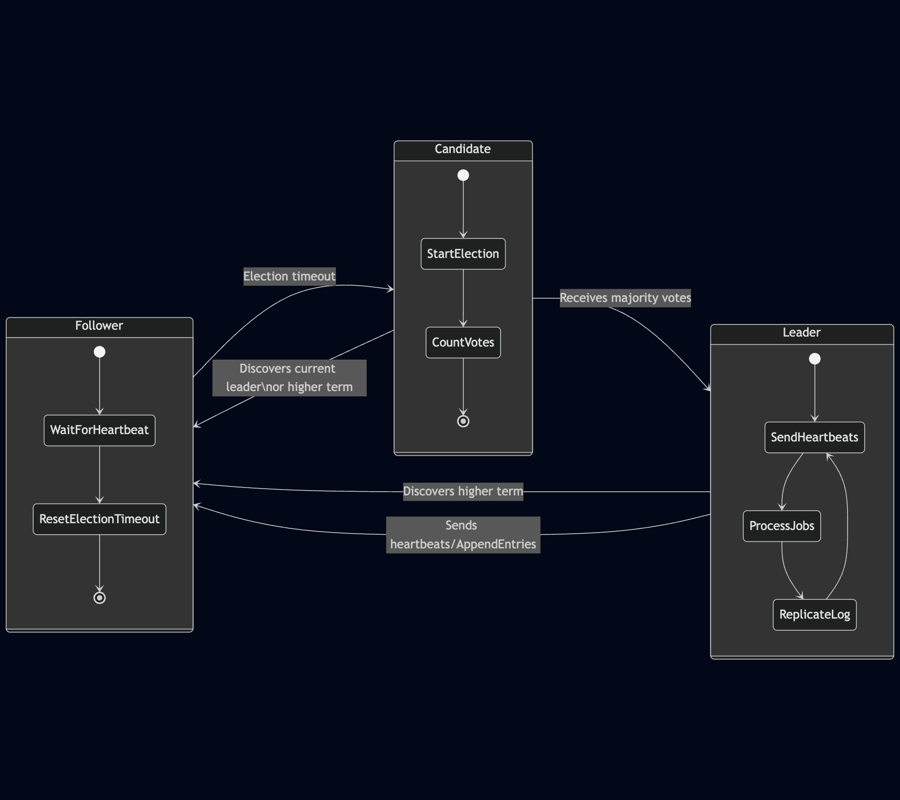
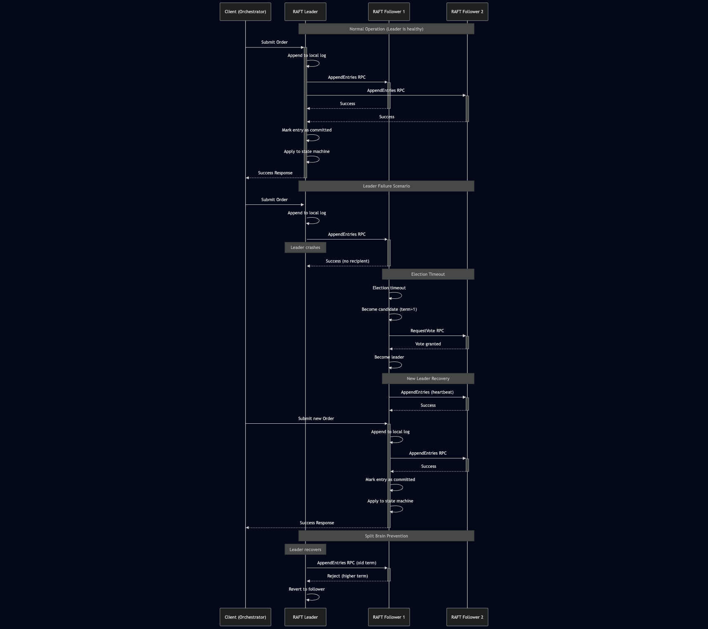
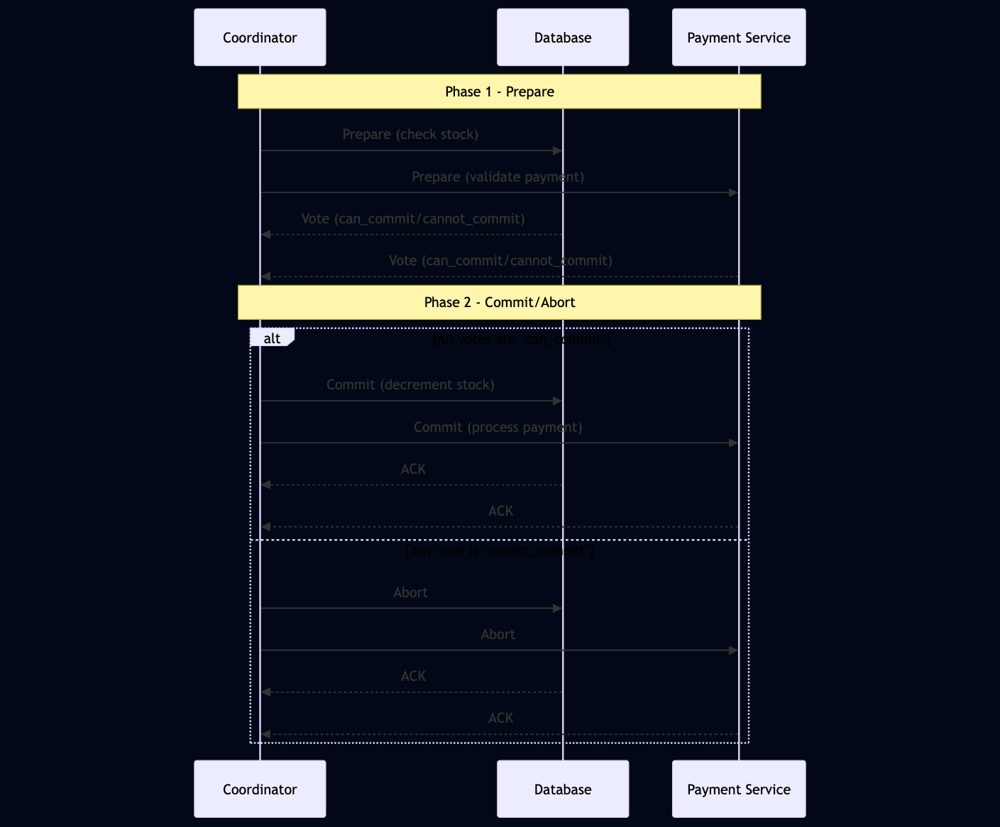
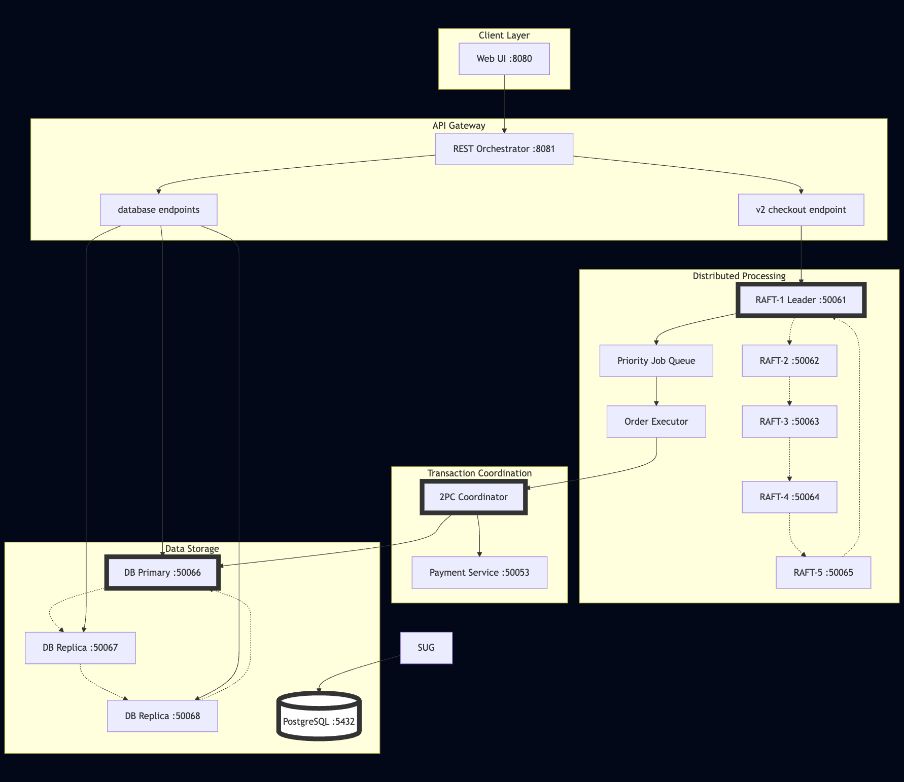
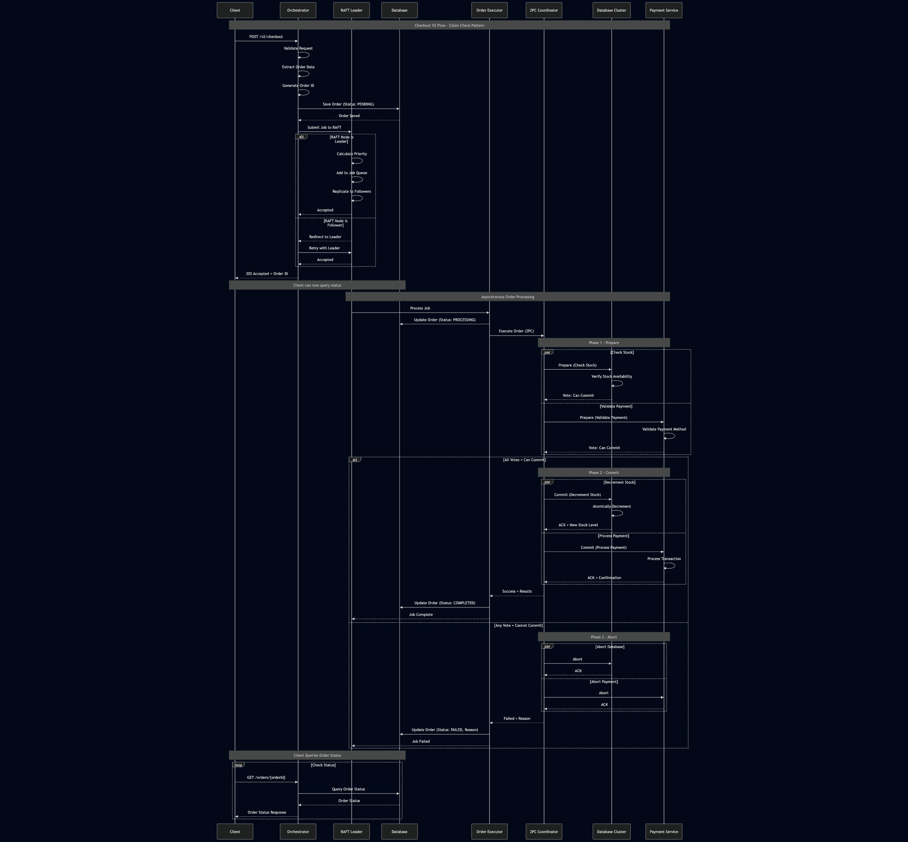

# Bookstore Microservices Architecture

## Overview
The Bookstore Application follows a modern microservices-based architecture. The architecture consists of three primary layers:
1. **Client-Facing Layer**
2. **Microservices Layer (gRPC Services)**
3. **Data Layer**

## Client-Facing Layer
### REST Checkout API
The **REST Checkout API** serves as the single entry point for client interactions. It handles customer checkout requests and orchestrates calls to the underlying microservices. Key features include:
- Orchestrating multiple microservices to complete the checkout process.
- The orchestrator acts as the single point of contact between the microservices.

#### Threading Implementation
Since several microservices are exchanging information we have threading implementation to pass the information between the microservices. The threading implementation is done using **ThreadPoolExecutor** from the **concurrent.futures** module. This allows for efficient management of multiple threads, enabling the application to handle concurrent requests without blocking the main thread. The threading implementation is designed to:
- Process multiple validation steps in parallel
- Handle early termination when a validation step fails
- Properly manage dependencies between validation steps
- Collect errors from all services

## Microservices Layer (gRPC Services)
This layer consists of independent services that handle specific tasks and communicate via **gRPC** 

### 1. Suggestions Microservice
- Connects to a **PostgreSQL database** with the **pgvector** extension.
- Uses **sentence-transformers** to generate vector embeddings of book descriptions, its title and the author.
- Provides **personalized book recommendations** based on vector similarity.
- Enables **efficient semantic search** capabilities for books.

### 2. Fraud Detection Service
- Analyzes checkout transactions for potential fraud.
- Returns a **risk assessment score** to the checkout service to prevent fraudulent activities.

### 3. Transaction Verification Service
- Performs **credit card validation** using the **Luhn algorithm** to verify card numbers.
- Checks **expiration dates** to ensure the card is still valid.
- Validates billing information for consistency
- Provides a **fast validation layer** before payment processing to prevent invalid transactions.

## Data Layer
### PostgreSQL Database
- Serves as the **primary data store** for the application.
- Stores book metadata, user transactions, and other essential records.

### pgvector Extension
- A **specialized PostgreSQL extension** that enables efficient **vector operations and similarity searches**.

## Architecture Diagram


## System Diagram


## Distributed Coordination with Vector Clocks

To manage distributed event ordering and consistency, the system uses a Vector Clock implementation that tracks causality across services.

### Vector Clock Diagram


### Implementation Details
- Each service maintains its own logical clock
- Events are timestamped with vector clocks
- When services communicate, they exchange and update their vector clocks
- This ensures consistent ordering of events across services
- Prevents race conditions in distributed processing
- Enables coordinated cleanup of order data across all services

## Failure Handling Model

The system implements a comprehensive failure handling model to ensure resilience and data consistency even when services or nodes fail.



### Key Failure Handling Mechanisms:

1. **Early Termination Pattern**
   - Validation failures trigger immediate cancellation of in-progress tasks
   - ThreadPoolExecutor with cancellation support
   - Error collection from all services

2. **Service Communication Failures**
   - gRPC error handling for service unavailability
   - Consistent error response format

3. **Data Consistency**
   - Vector clocks ensure consistent state across services
   - Coordinated cleanup prevents orphaned data
   - Each service verifies vector clock before cleanup

## Raft Consensus Algorithm

For distributed order processing, we implement the Raft consensus algorithm in our Order Executor service cluster.

### Core Mechanisms
- **Leader Election**: When followers don't hear from a leader, they become candidates and request votes
- **Log Replication**: Leaders accept commands and replicate them to followers
- **Safety**: Various rules ensure consistency even during network partitions

### Practical Features
- Priority-based job queue
- Thread-safety with multiple locks
- gRPC communication between nodes
- Peer discovery and dynamic configuration

### Communication Patterns


### Sequence Diagram


## System Model

The Bookstore Microservices architecture follows several system models to ensure reliability, scalability, and maintainability:

1. **API Gateway Pattern**
   - Orchestrator service acts as a gateway
   - Manages client requests and coordinates microservices
   - Provides a unified interface to clients

2. **Concurrent Execution Model**
   - ThreadPoolExecutor for parallel validation steps
   - Event flags manage dependencies between steps
   - Early termination for validation failures

3. **Event-Driven Architecture**
   - Vector clocks maintain causal relationships
   - Services react to events rather than direct commands
   - Asynchronous processing where appropriate

4. **Consensus-Based Distribution**
   - RAFT algorithm for distributed consensus
   - Leader-based coordination for consistent state
   - Automatic failover and recovery

5. **Fault Tolerance Model**
   - Graceful degradation when services are unavailable
   - Consistent error handling and reporting


## Checkpoint 3

## Overview
The Bookstore Application now includes a distributed database system with primary-replica architecture and leader election capabilities. The database system consists of  3 nodes working together to provide high availability and consistency.

### Database Nodes Architecture

#### Node Types
- **Primary Node**: Handles all write operations and replicates changes to replicas
- **Replica Nodes**: Handle read operations and participate in leader elections
- **Candidate Nodes**: Temporary state during leader election

#### Leader Election
The database uses a Raft-like consensus algorithm for leader election:
- Election timeouts trigger new elections
- Nodes vote for candidates based on log consistency
- Majority votes required to become leader
- Split-brain prevention through term tracking

### Database Service Configuration

#### Ports
- **db-node1**: 50066 (external) → 50052 (internal)
- **db-node2**: 50067 (external) → 50052 (internal)
- **db-node3**: 50068 (external) → 50052 (internal)

#### Environment Variables
```yaml
DB_NODE_ID=db-node1
DB_PORT=50052
DB_ROLE=REPLICA
DB_PEERS=db-node2:50052,db-node3:50052
DB_NODE_COUNT=3
```

### Operations

#### Read Operations
- Can be performed on any node (primary or replica)
- Round-robin load balancing is applied for distribution
- Automatic fallback if a node is unavailable

#### Write Operations
- Must be performed on the primary node
- Redirection happens if a replica receives a write request
- Version tracking for each key

#### Stock Management
- Atomic decrement operations for inventory
- Stock stored with key format: `stock:{book_name}`
- Insufficient stock checks before decrementing

### API Endpoints

#### DatabaseService Methods
- `Read(key)`: Read a value from the database
- `Write(key, value, type)`: Write a value to the database
- `DecrementStock(key, amount)`: Atomically decrement stock
- `GetStatus()`: Get node status and role information
- `ReadAll()`: Read all key-value pairs from database (debugging purposes mainly)

### Health Checks
Each database node includes health checks:
```yaml
healthcheck:
  test: ["CMD", "python", "-c", "import socket; s = socket.socket(); s.connect(('localhost', 50052))"]
  interval: 10s
  timeout: 5s
  retries: 3
  start_period: 10s
```

### Database Client
The system includes a DatabaseClient that:
- Automatically discovers the primary node
- Handles failover and retries
- Provides consistent interface for all operations
- Manages gRPC connections efficiently

## Two-Phase Commit Protocol

### Overview
The Two-Phase Commit (2PC) protocol is added to ensure consistency across distributed transactions involving multiple services. This ensures that either all operations succeed or all are rolled back, maintaining data integrity.

### Architecture Components

#### TwoPhaseCommitCoordinator
The coordinator manages the entire 2PC process:
- Generates unique transaction IDs
- Tracks transaction state throughout lifecycle
- Manages communication with all participants
- Handles commit/abort decisions

#### Participants
1. **Database Service**: Manages book inventory
2. **Payment Service**: Processes financial transactions (simulated right now)

### Protocol Phases

#### Phase 1: Prepare
1. Coordinator asks all participants if they can commit
2. Database checks stock availability
3. Payment service validates payment method
4. Participants respond with vote (can_commit/cannot_commit)

#### Phase 2: Commit/Abort
- If all participants vote "can commit" → Coordinator sends COMMIT
- If any participant votes "cannot commit" → Coordinator sends ABORT
- Participants execute the decision and acknowledge

### Transaction Flow


### Implementation

#### Database Operations
- **Prepare**: Validates stock availability
- **Commit**: Decrements stock atomically
- **Abort**: Cancels transaction (no changes needed)

#### Payment Operations
- **Prepare**: Validates payment method and customer
- **Commit**: Processes payment and generates confirmation
- **Abort**: Cancels payment authorization

#### Transaction States
- `STARTED`: Transaction initiated
- `PREPARING`: Asking participants to prepare
- `COMMITTING`: Telling participants to commit
- `COMMITTED`: Transaction completed successfully
- `ABORTING`: Telling participants to abort
- `ABORTED`: Transaction cancelled

### Error Handling

#### Failure Scenarios
1. **Participant Failure During Prepare**: Transaction aborted
2. **Participant Failure During Commit**: Retry with timeout
3. **Coordinator Failure**: Transaction times out and is aborted

#### Compensation
- If commit fails after some participants have committed, compensating transactions may be needed
- Current implementation focuses on preventing partial commits

### Configuration

#### Environment Variables
```yaml
DB_NODES=db-node1:50052,db-node2:50052,db-node3:50052
PAYMENT_SERVICE=payment-service:50053
```

#### Timeouts
- Default timeout: 5 seconds per operation
- Maximum retries: 3 attempts

### Payment Service

#### Port Configuration
- Internal port: 50053
- Service name: `payment-service`

#### Payment Methods
- Credit Card (95% success rate in simulation)
- Bank Transfer (90% success rate in simulation)

#### Payment Flow
1. Generate unique payment ID
2. Validate payment method
3. Process payment on commit
4. Generate confirmation code

### Integration with RAFT

The 2PC coordinator is integrated with the RAFT order executor:
1. RAFT cluster receives and prioritizes orders
2. Leader node executes orders using 2PC
3. Results are recorded in RAFT log
4. Failed transactions trigger compensating actions

### End-to-End Order Processing

This diagram shows how all components work together to process an order from client request to completion.


## Complete Order Processing Sequence


### 3. Distribution Flow (V2)
- Orchestrator → RAFT Leader
- Leader → Job Queue (priority-based)
- Job Queue → Order Executor

### 4. Transaction Flow
- Order Executor → 2PC Coordinator
- 2PC → Database + Payment (parallel prepare)
- 2PC → Database + Payment (parallel commit)

### 5. Data Operations
- Write operations → Primary node only
- Read operations → Load balanced across all nodes
- Replication → Primary to replicas

### 6. Result Flow
- Services → Orchestrator → Client

## Key Integration Points

1. **REST to gRPC Bridge**: Orchestrator translates HTTP to gRPC
2. **RAFT to 2PC Bridge**: Order Executor manages transaction lifecycle
3. **Database Service Layer**: Abstracts distributed database complexity
4. **Priority Queue**: Ensures important orders processed first

## System Guarantees

1. **Consistency**: RAFT consensus + 2PC transactions
2. **Availability**: Leader election + replica failover
3. **Partition Tolerance**: Split-brain prevention
4. **Durability**: Replicated logs + database replication
5. **Atomicity**: Two-phase commit protocol
