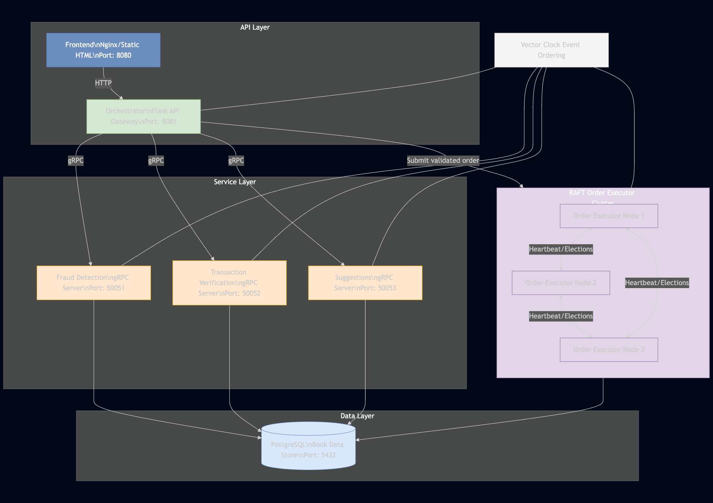

# Bookstore Microservices Architecture

## Overview
The Bookstore Application follows a modern microservices-based architecture. The architecture consists of three primary layers:
1. **Client-Facing Layer**
2. **Microservices Layer (gRPC Services)**
3. **Data Layer**

## Client-Facing Layer
### REST Checkout API
The **REST Checkout API** serves as the single entry point for client interactions. It handles customer checkout requests and orchestrates calls to the underlying microservices. Key features include:
- Orchestrating multiple microservices to complete the checkout process.
- The orchestrator acts as the single point of contact between the microservices.

#### Threading Implementation
Since several microservices are exchanging information we have threading implementation to pass the information between the microservices. The threading implementation is done using **ThreadPoolExecutor** from the **concurrent.futures** module. This allows for efficient management of multiple threads, enabling the application to handle concurrent requests without blocking the main thread. The threading implementation is designed to:
- Process multiple validation steps in parallel
- Handle early termination when a validation step fails
- Properly manage dependencies between validation steps
- Collect errors from all services

## Microservices Layer (gRPC Services)
This layer consists of independent services that handle specific tasks and communicate via **gRPC** 

### 1. Suggestions Microservice
- Connects to a **PostgreSQL database** with the **pgvector** extension.
- Uses **sentence-transformers** to generate vector embeddings of book descriptions, its title and the author.
- Provides **personalized book recommendations** based on vector similarity.
- Enables **efficient semantic search** capabilities for books.

### 2. Fraud Detection Service
- Analyzes checkout transactions for potential fraud.
- Returns a **risk assessment score** to the checkout service to prevent fraudulent activities.

### 3. Transaction Verification Service
- Performs **credit card validation** using the **Luhn algorithm** to verify card numbers.
- Checks **expiration dates** to ensure the card is still valid.
- Validates billing information for consistency
- Provides a **fast validation layer** before payment processing to prevent invalid transactions.

## Data Layer
### PostgreSQL Database
- Serves as the **primary data store** for the application.
- Stores book metadata, user transactions, and other essential records.

### pgvector Extension
- A **specialized PostgreSQL extension** that enables efficient **vector operations and similarity searches**.

## Architecture Diagram

## System Diagram

## Distributed Coordination with Vector Clocks

To manage distributed event ordering and consistency, the system uses a Vector Clock implementation that tracks causality across services.

### Vector Clock Diagram

### Implementation Details
- Each service maintains its own logical clock
- Events are timestamped with vector clocks
- When services communicate, they exchange and update their vector clocks
- This ensures consistent ordering of events across services
- Prevents race conditions in distributed processing
- Enables coordinated cleanup of order data across all services

## Failure Handling Model

The system implements a comprehensive failure handling model to ensure resilience and data consistency even when services or nodes fail.

### Key Failure Handling Mechanisms:

1. **Early Termination Pattern**
   - Validation failures trigger immediate cancellation of in-progress tasks
   - ThreadPoolExecutor with cancellation support
   - Error collection from all services

2. **Service Communication Failures**
   - gRPC error handling for service unavailability
   - Circuit breaker pattern prevents cascading failures
   - Consistent error response format

3. **Data Consistency**
   - Vector clocks ensure consistent state across services
   - Coordinated cleanup prevents orphaned data
   - Each service verifies vector clock before cleanup

## Raft Consensus Algorithm

For distributed order processing, we implement the Raft consensus algorithm in our Order Executor service cluster.

### Core Mechanisms
- **Leader Election**: When followers don't hear from a leader, they become candidates and request votes
- **Log Replication**: Leaders accept commands and replicate them to followers
- **Safety**: Various rules ensure consistency even during network partitions

### Practical Features
- Priority-based job queue
- Thread-safety with multiple locks
- gRPC communication between nodes
- Peer discovery and dynamic configuration

### Communication Patterns

### Sequence Diagram

## System Model

The Bookstore Microservices architecture follows several system models to ensure reliability, scalability, and maintainability:

1. **API Gateway Pattern**
   - Orchestrator service acts as a gateway
   - Manages client requests and coordinates microservices
   - Provides a unified interface to clients

2. **Concurrent Execution Model**
   - ThreadPoolExecutor for parallel validation steps
   - Event flags manage dependencies between steps
   - Early termination for validation failures

3. **Event-Driven Architecture**
   - Vector clocks maintain causal relationships
   - Services react to events rather than direct commands
   - Asynchronous processing where appropriate

4. **Consensus-Based Distribution**
   - RAFT algorithm for distributed consensus
   - Leader-based coordination for consistent state
   - Automatic failover and recovery

5. **Fault Tolerance Model**
   - Circuit breaker pattern prevents cascading failures
   - Graceful degradation when services are unavailable
   - Consistent error handling and reporting
